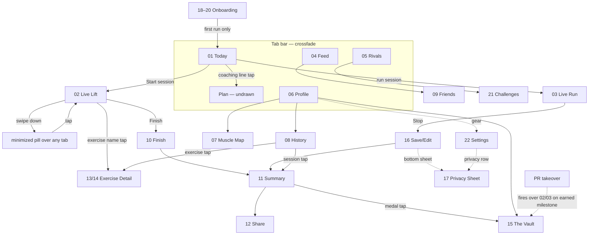

# Volt — Design System v2 ("numerals as layout")

> **v2 supersedes the v1 cyan spec entirely** (v1 history: cyan `#06B6D4` accent, card-based
> layouts — abandoned Sep 2026 after the design was rebuilt in the Claude Design project).
> **Source of truth for pixels:** the Claude Design project "Volt" → `Volt - App Screens.dc.html`
> (23 artboards). This doc is the written contract the app implements.
> Validated three ways: design-project iteration, Claude mockup rounds, and a third-party
> generator (Lovable) reproducing the grammar faithfully from this spec alone.

## 1. Thesis

Screens built without dashboard grammar: **zones separate by darkness, one number owns each
screen, and the map/graph is the artwork.** The app reads as a precision instrument
(Teenage Engineering × Braun), not a fitness dashboard.

## 2. Tokens

### Surfaces — the darkness ladder (no cards, no borders, no shadows, no glows; matte)
| Token | Value | Use |
|---|---|---|
| base | `#121212` | screen background |
| sunken | `#0D0D0D` | nav zones (tab bar), recessed strips |
| raised | `#171717` | session modules, list zones |
| hero-black | true black | reserved: the one artwork panel per screen (charts/maps) |

Zones separate by luminance only. If a dense zone stops reading, widen its darkness step or use
a single 1px hairline — never a card.

### Color — chrome is grayscale; color only ever touches data
| Token | Value | Meaning |
|---|---|---|
| ember | `#FF5A1F` | strength data, strength accents, the bolt (sole brand exception) |
| jade | `#31A98D` | endurance data (one jade everywhere — unified Sep 2026) |
| gold | (defined in design file) | **earned rewards only** — medals, streaks, crowns. Locked things fill stone gray, never dim gold |
| yellow | caution | gaps/undertrained callouts only |
| text ramp | `#FAFAFA / #A8A8AA / #6E6E70` | 3-step hierarchy; never pure white |

Rating always wears its tier chip (per-lift ratings use a muted stone chip so they don't compete
with the global Volt rating chip); Load always renders plain with a caption ("LOAD · 7 DAYS").
The two numbers must never be visually confusable.

### Typography
- **Numerals, units, timestamps, metadata:** JetBrains Mono. Uppercase mono (≈11px,
  letterspaced) is metadata only — never headings.
- **Headings:** humanist sans, written as sentences ("Monday. Pull day.", "Four seconds under
  target."), two-tone via the ramp.
- **One giant numeral owns each screen** (~92–104px): `842`, `147.5`, `3:52`. Everything else
  small and quiet beneath it. Hierarchy comes from ramp + weight, not size.

### Header washes (screen identity)
A barely-there tinted gradient at the top of key screens: ember on strength contexts, jade on
endurance contexts, none on rest. The only permitted gradient besides chart data fills.

## 3. Grammar rules (the review checklist)
1. One number and one action nameable in under a second, per screen.
2. At most two supporting modules visible; everything else behind a tap (density principle #6).
3. No bordered cards, glows, shadows, or parallax. Matte everything.
4. Color = data. Grayscale chrome. Gold = earned only.
5. Believable, coherent data in every mock (see §6).
6. No fake OS chrome (status bars, keyboards) beyond the minimal `9:41` convention already in
   the artboards; no stock photos; icons are drawn strokes or the bolt.
7. Every competitive surface carries a visible hide affordance; no all-time leaderboards.
8. Privacy state is legible without opening the privacy sheet ("ENDS TRIMMED · HOME HIDDEN").
9. Everything is editable after the fact and looks it ("EDITED 08:04 · 2 SEP").

## 4. Screen inventory (design-project artboards, with each screen's One Number)
| # | Screen | One number | Notes |
|---|---|---|---|
| 01 | Today | 842 unified load | ember wash; race countdown metadata; session preview; coaching line collapsed |
| 02 | Live Lift | 147.5 kg current set | completed sets fold to "2 sets logged · avg RPE 7.5"; single thumb action |
| 03 | Live Run | 3:52 /km | full-bleed pace artwork; beacon row; rep splits |
| 04 | Feed | — (content) | composer own block; kudos; trained-together card |
| 05 | Rivals | 842 vs 879 load duel | tier chips; top-3 board + Show all; consistency crown |
| 06 | Profile | 1842 rating (tier chip) | full month calendar w/ dual dots; milestones in gold |
| 07 | Muscle Map | volume by region | `volt-body-map.svg` (locked asset, CSS-var recolor); UNDERTRAINED callout |
| 08 | History | 148 sessions | weekly groups; per-session load + muscle tags |
| 09 | Friends | 34 friends | live "training now" status; near-rating matches |
| 10 | Workout Finish | elapsed time | RPE row; estimated load computing |
| 11 | Summary | 190 load earned | earned-vs-planned track; rating delta w/ chip |
| 12 | Share | — (the card) | per-field toggles; true 1080×1920 story card beside |
| 13 | Exercise Detail · Charts | 105 kg e1RM | E1RM/HEAVIEST/VOLUME selector, one chart per view |
| 14 | Exercise Detail · Records | 120 kg Club 88% | PR list, gold = earned rows only |
| 15 | The Vault | 34/61 medals | cohort framing ("Top 12% · HYROX MEN 30–34"), never a rank integer |
| 16 | Save/Edit Activity | — | jade run data; edit-forever framing |
| 17 | Privacy Sheet | — | THE single home of privacy; live map-trim preview |
| 18–20 | Onboarding ×3 | 0:47 first set | one question → seeded week (556 planned load) → first set logged |
| 21 | Challenges | 24-day crown streak | rolling windows only; per-surface hides + HIDE ALL |
| 22 | Settings | — | dense hairline rows; PR-type toggles; "no tiers" closing line |
| 23 | Icon + Splash | — | bolt at 120/60/32px on `#121212` |

Still undrawn: **Plan tab screen** and the **routine/cardio-workout builder** (the two known gaps).

## 5. Motion spec

**Global principles:** every animation plays **once**; nothing loops except live data (timers,
GPS, rest countdown). Transitions 200–300ms ease-out. No springs on data, no glow pulses, no
parallax. Motion is information, never decoration.

| Where | Animation |
|---|---|
| Today load | 842 counts up once on load; split bar fills once |
| Live Lift | rest countdown ticks; set-check state change (instant, no confetti); swipe-down minimizes to a pill |
| Live Run | pace + splits update live; beacon dot may pulse (live-data exception) |
| Finish → Summary | estimated load resolves to earned load (count settles); rating delta ticks up after |
| PR moment | the ONE full-screen takeover — earned milestones only, never taps |
| Vault | a ring fills once when a medal unlocks; otherwise static |
| Muscle map / heatmaps / charts | draw-in once on first view; static after |
| Onboarding | the 0:47 stopwatch runs live until first set logged |
| Tab switches | crossfade ≤200ms; no slides |
| Lock-screen Live Activity | countdown only |

## 6. Data coherence (the anti-slop rule)
One persona across every screen: **Jamie Strand**, Berlin, 148 sessions, YR 2, rating 1842
(Contender), Hyrox Frankfurt · 19 OCT 2026, current date Mon 21 Sep 2026. All numbers reconcile
(148 → "2 to 150"; 12 weeks out − 5 weeks ≈ 47 days; bench e1RM 105 everywhere). Any new mock
joins this dataset; fake-looking data reads as AI slop and fails review.

## 7. Navigation map (how areas connect)

Modality legend: solid = push; dotted = sheet/overlay; the PR takeover is the only full-screen
interrupt in the app. Ad-hoc logging: long-press Start on Today opens an empty Live Lift (no
plan required).

## 8. Assets
- Muscle figure: `design-screens/body-map/volt-body-map.svg` — LOCKED; recolor via CSS variables
  (`--vol-<region>`), never redraw; mirrored halves are real elements (no `<use>`).
- Bolt: `<polygon points="12 0,20 0,8 12,16 12,0 24,4 13,0 13"/>` viewBox 0 0 20 24, ember.
- Share cards: 1080×1920, dark, mono numerals, session's signature graphic; beautiful or absent.

## 9. Open items
1. Gold's exact hex + the tier-name set (branding session; thresholds are percentile-anchored
   per RATINGS.md, so no numbers needed).
2. Draw the Plan screen and the routine/cardio-workout builder.
3. Contrast-floor check on OLED at low brightness (the 2–3% zone-luminance risk) and a
   color-vision pass on ember-vs-jade.
